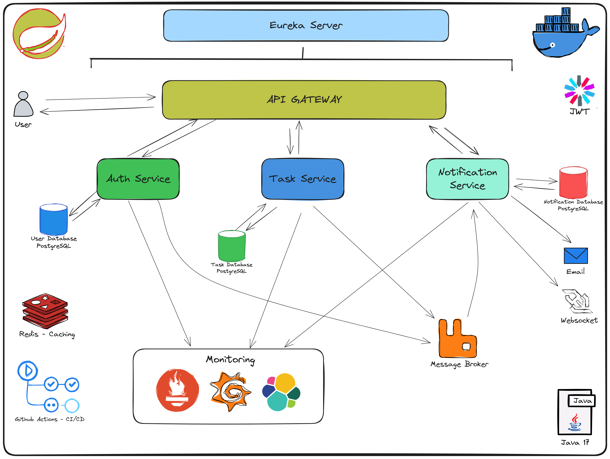

# TaskManagement Microservices Backend

A robust task management system built with Spring Boot microservices architecture, featuring CI/CD integration, comprehensive monitoring, and observability.

## Table of Contents
- [Architecture Overview](#architecture-overview)
- [Key Features](#key-features)
- [Technologies](#technologies)
- [Prerequisites](#prerequisites)
- [Getting Started](#getting-started)
  - [Local Development Setup](#local-development-setup)
  - [Quick Start with start-services.sh](#quick-start-with-start-servicessh)
  - [Development with Monitoring](#development-with-monitoring)
- [Project Structure](#project-structure)
- [CI/CD Pipeline](#cicd-pipeline)
  - [Workflows](#workflows)
- [API Documentation](#api-documentation)
- [Rebuilding Individual Services](#rebuilding-individual-services)
- [License](#license)

## Architecture Overview

This project implements a microservices architecture with the following components:

- **Discovery Server**: Service registry using Netflix Eureka
- **API Gateway**: Entry point for all client requests, handles routing and authentication
- **Auth Service**: Manages user authentication, registration, and JWT token generation
- **Task Service**: Core business logic for task management, boards, and tables
- **Notification Service**: Handles real-time notifications via WebSockets and email alerts
- **Redis**: Provides distributed caching to improve performance and reduce database load

## Key Features

- **User Authentication**: Secure JWT-based authentication with role-based access control
- **Task Management**: Create, update, and organize tasks with due dates and assignees
- **Board Organization**: Organize tasks in customizable boards and tables
- **Real-time Notifications**: Receive instant notifications about task events via WebSockets
- **Email Alerts**: Get email notifications for task assignments and deadlines
- **Distributed Caching**: Redis-based caching to improve API response times and reduce database load
- **Comprehensive Monitoring**: Full observability with Prometheus, Grafana, and ELK stack
- **Scalable Architecture**: Independent services that can scale according to demand
- **CI/CD Pipeline**: Automated testing, building, and deployment with GitHub Actions
- **API Documentation**: Well-documented APIs with OpenAPI/Swagger integration

## Technologies

- **Framework**: Spring Boot, Spring Cloud
- **Service Discovery**: Netflix Eureka
- **API Gateway**: Spring Cloud Gateway
- **Database**: PostgreSQL
- **Caching**: Redis
- **Messaging**: RabbitMQ
- **Authentication**: JWT-based auth
- **Documentation**: OpenAPI/Swagger
- **Containerization**: Docker
- **CI/CD**: GitHub Actions
- **Monitoring**: Prometheus, Grafana, Zipkin, ELK Stack

## Prerequisites

- Java 17
- Docker and Docker Compose
- Maven
- Git

## Getting Started

1. Clone the repository:
   ```bash
   git clone https://github.com/phuonghieuto/taskboard.git
   cd taskboard
   ```
2. Create environment file from the template:
    ``` bash
    cp .env.example .env
    ```
3. Edit the .env file to configure your environment variables.

### Quick start with both docker and monitoring
```bash
./start-services.sh
```

### Local Development Setup
```bash
docker-compose -f docker-compose-dev.yaml up -d
```
Access the services:
- Discovery Server: http://localhost:8761
- API Gateway: http://localhost:8080
- Swagger UI: http://localhost:8080/swagger-ui.html

### Development with Monitoring
```bash
docker-compose -f docker-compose-dev.yaml -f docker-compose-monitoring.yaml up -d
```
Access monitoring dashboards:
- Grafana: http://localhost:3000 (default login: admin/password)
- Prometheus: http://localhost:9090
- Zipkin: http://localhost:9411
- Kibana: http://localhost:5601

## Project Structure

```
├── api-gateway/                # API Gateway service
├── auth-service/               # Authentication service
├── database/                   # Database initialization scripts
├── discovery-server/           # Service registry
├── notification-service/       # Notification service
├── task-service/               # Task management service
├── monitoring/                 # Monitoring configuration files
├── keys/                       # JWT keys (for dev only)
├── docker-compose.yaml         # Production Docker Compose
├── docker-compose-dev.yaml     # Development Docker Compose
├── docker-compose-monitoring.yaml # Monitoring stack
└── .github/workflows/          # CI/CD pipelines
```

## CI/CD Pipeline
The project uses GitHub Actions for continuous integration and delivery:

- Testing: Automated tests run on every push and pull request
- Building: Docker images are built and tested
- Publishing: Images are pushed to Docker Hub on successful builds
- Deployment: Automated deployment to staging/production environments

## Workflows
- `automated-testing.yml`: Runs all tests and generates reports
- `cd-staging.yml`: Builds and pushes Docker images with the latest tag for staging deployment
- `cd-production.yml`: Builds and pushes Docker images with version tags for production deployment

## API Documentation

API documentation is available via multiple methods:

### Swagger UI
Access the interactive API documentation through Swagger UI:
- Combined API docs: http://localhost:8080/swagger-ui.html
- Auth Service API: http://localhost:8080/api/v1/auth/api-docs
- Task Service API: http://localhost:8080/api/v1/tasks/api-docs
- Notification Service API: http://localhost:8080/api/v1/notifications/api-docs

### Postman Collection
A comprehensive Postman collection is provided in the `/postman` directory with ready-to-use API requests for all services:

1. Import the collection in Postman:
   - Open Postman
   - Click "Import" → "File" → select `Task Manager API definition.postman_collection.json`

2. Import the environment:
   - Click "Import" → "File" → select `Task_Management.postman_environment.json`
   - Select "Task_Management" environment from the environment dropdown in Postman

3. Using the collection:
   - Start with the Auth/register or Auth/login requests to obtain tokens
   - The collection automatically saves authentication tokens to environment variables
   - All subsequent requests will use these tokens for authorization
   - Each endpoint includes documented request examples and response scenarios

## Rebuilding Individual Services
To rebuild and restart a single service, use the provided script:
```bash
./rebuild-single-service.sh <service-name>
```
Example:
```bash
./rebuild-single-service.sh task-service
```

## License
MIT license
